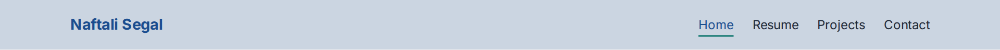
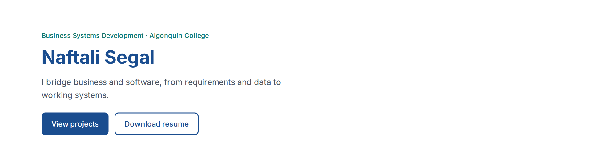
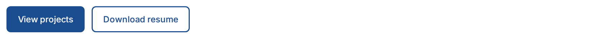
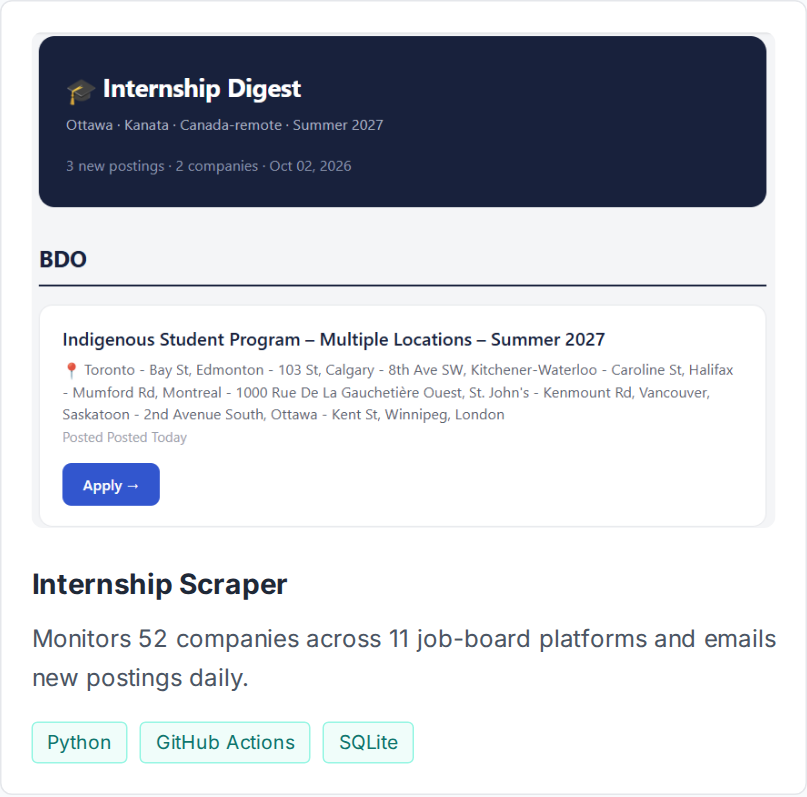
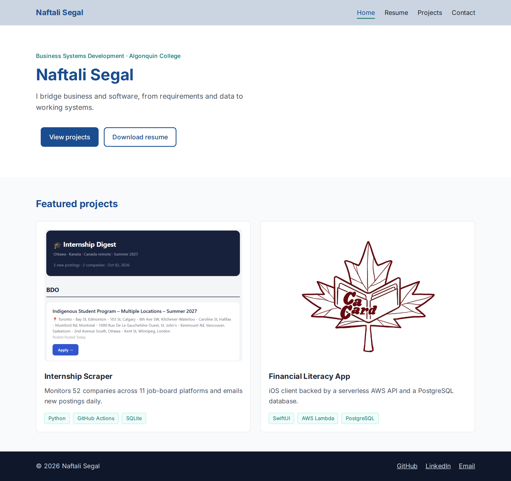
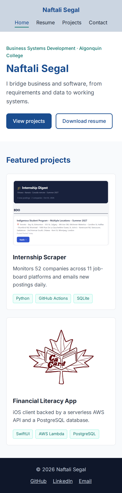

# Naftali Segal's Portfolio Design System

This document describes the design system for my portfolio website: the colours, typography, components and layout that every page is built from. It includes screenshots of the HTML/CSS mock-ups so the design is clear before the rest of the site is built.

**Design direction:** The site is aimed at recruiters in both business and technology roles, so the base is a clean, light, professional layout in navy, with a teal accent, tech tag pills and a dark footer.

---

## 1. Colour Palette

All colours are defined once as CSS custom properties (design tokens) in `:root` and used everywhere through `var()`.

| Token | Hex | Role |
|---|---|---|
| `--color-primary` | `#1a4d8f` | Navy. Name, headings, links and the primary button. Carried over from my resume so both share one brand. |
| `--color-accent` | `#0f766e` | Teal. Used sparingly: the eyebrow line, the active nav underline and the tech tags. |
| `--color-accent-light` | `#f0fdfa` | Pale teal. Tag background. |
| `--color-accent-border` | `#99f6e4` | Light teal. Tag border. |
| `--color-text` | `#1f2937` | Body text. Near-black, which is easier to read than pure black. |
| `--color-muted` | `#4b5563` | Secondary text: taglines and card descriptions. |
| `--color-header-bg` | `#cbd5e1` | Light slate. Header background. |
| `--color-bg` | `#f8fafc` | Page background (very light grey). |
| `--color-surface` | `#ffffff` | Cards and the hero section. |
| `--color-border` | `#e5e7eb` | Card borders and dividers. |
| `--color-footer` | `#0f172a` | Dark navy footer background. |
| `--color-footer-text` | `#cbd5e1` | Footer text and links. |

---

## 2. Typography

- **Font:** Inter, with Arial as a fallback. Inter is clean, modern and easy to read on screens.
- **One font for the whole site.** Headings stand out through size and colour instead of different fonts:
  - **Name and section headings:** large, bold, navy
  - **Card titles:** bold, dark text
  - **Eyebrow line and tags:** small, teal
  - **Taglines and descriptions:** grey (muted)
  - **Body text:** regular, dark text

---

## 3. Components

### Header and Navigation
- **Design:** Light slate background, with my name on the left and the navigation links on the right. The current page and hovered links turn navy with a teal underline.
- **Why the tinted header:** a white header right above the white hero section had no visual break. The slate tint separates the navigation from the content.
- **Phones:** the name and links stack and are centred.



### Hero
- **Design:** A spacious white section with a small teal line (program and school), my name as the biggest heading, a one-sentence tagline in grey, and two buttons.



### Buttons
- **Design:** Rounded buttons with a navy border, in two styles:
  - **Primary:** filled navy with white text, for the main action.
  - **Secondary:** outlined in navy, for the secondary action.
- Only one primary button per section, so the main action stands out.



### Project Card (reusable component)
- **Design:** White card with a light border and rounded corners. Each card has:
  1. **Image (optional):** a screenshot or logo, always cropped to the same rectangular shape so every card matches.
  2. **Title**
  3. **Short description** in grey
  4. **Tech tags:** small teal labels for the technologies used.
- Every project uses this same card, so new projects (Yatzy, Hospital Triage) can be added without new styles.



### Footer
- **Design:** Dark navy background with light text. Copyright on the left, GitHub / LinkedIn / Email links on the right. The dark footer gives every page a clear ending.
- **Phones:** stacks and is centred.


---

## 4. Layout

- **Content width:** content stays in a centred column so it doesn't stretch too wide on big monitors, while the header, hero and footer backgrounds still go edge to edge.
- **Project grid:** cards sit side by side on a laptop and stack one per row on a phone.
- **Spacing:** sections have plenty of space between them. On phones, all sections line up along the same left edge.
- **Phones:** the header and footer stack, spacing shrinks, and the name gets smaller.

### Full page (desktop)



### Mobile



---

## 5. Design Tokens in Code

```css
:root {
    --color-primary: #1a4d8f;
    --color-accent: #0f766e;
    --color-text: #1f2937;
    --color-muted: #4b5563;
    --color-border: #e5e7eb;
    --color-bg: #f8fafc;
    --color-surface: #ffffff;
    --color-footer: #0f172a;
    --color-footer-text: #cbd5e1;
    --color-accent-light: #f0fdfa;
    --color-accent-border: #99f6e4;
    --color-header-bg: #cbd5e1;

    --font-main: "Inter", Arial, sans-serif;
    --radius: 8px;
}
```

---

## Conclusion

This design system is the blueprint for the portfolio. It defines one palette, one type scale and a small set of reusable components, so every page stays consistent as new projects are added throughout the semester.
